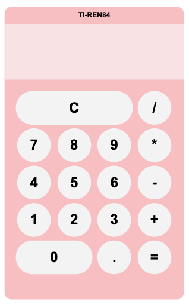

# Calculator

This calculator app features a clean, responsive interface built with HTML and CSS, using a grid-based layout for all number buttons, operators, and additional controls. It adapts smoothly across mobile, tablet, and desktop devices for an accessible user experience.

Interactive functionality is powered by JavaScript, enabling users to enter numbers, perform arithmetic operations (addition, subtraction, multiplication, division), and interact using either on-screen buttons or keyboard input. The display updates dynamically to show inputs, operations, and results, and includes a clear button to reset the calculator at any time.

## Instructions
#### Launch the App
Open the calculator application on your device. You’ll see the display area at the top and the keypad below.

1. Fork and clone the repo
2. `cd calculator`
3. `open index.html`

#### Enter Numbers
Tap or click the number buttons (0–9) to enter values. The numbers will appear on the display.

#### Choose an Operation
Select the operation you want to perform:

`+` for addition

`−` for subtraction

`*` for multiplication

`/` for division

#### Calculate the Result
Press `=` to perform the calculation. The result will appear on the display.

#### Clear the Display
Press `C` to clear the current entry.